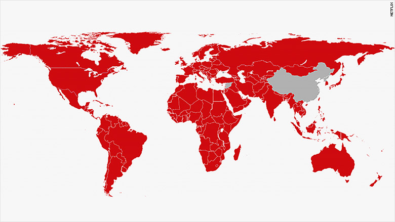
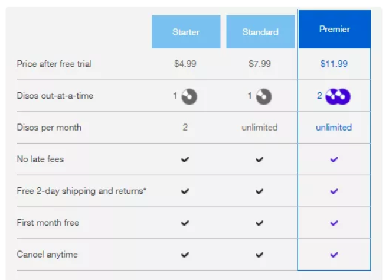

# netflix

https://fourweekmba.com/how-does-netflix-make-money/

https://www.statista.com/statistics/250934/quarterly-number-of-netflix-streaming-subscribers-worldwide/

Netflix是一家流媒体内容提供商，允许用户在各种连接互联网的设备上观看电视节目，电影，纪录片等。 该公司还提供DVD租赁计划，在那里提供DVD上的节目和电影。

公司基于订阅模式运行。 用户支付每月订阅计划的费用，并可以访问Netflix提供的流媒体节目，电影，纪录片和其他内容，以及他们支付的质量（SD，HD，Ultra HD）。

它改变了用户消费媒体的传统方式 。 Netflix 近期出品的连续剧：怪奇物语，毒枭，黑镜在业内都是很受好评的作品。Netflix 在1997年成立时只有一个网站，和925部片供出租，到如今已经市值过1500亿美元， 在全球有超过 1.37 亿的订阅者。 

2017年，netflix 服务扩展到了全球，除了中国，朝鲜，叙利亚，其它国家普遍都能使用 Netflix的订阅服务。

##### 历史

* 1997 年 在硅谷成立，最初的Netflix是一个录像带出租平台，用户通过邮件订购，Netflix把录像带发过去，并按次收取费用
* 1999 年 ，Netflix 提出了 订阅服务这个概念
* 2007 年， Netflix 开始转变商业模式，从邮件出租 Dvd 转到提供在线视频播放服务
* 2017年，Netflix 在全球范围提供服务，除了几个国家

##### 公司收入

* 2013        43亿美元
* 2014        55亿美元
* 2015        67亿美元
* 2016        88亿美元
* 2017        116亿美元

2017年 有 50亿美元的收入是来自美国以外的其它国家

### 商务模式介绍

简单来说，Netflix 采用的就是 订阅-服务的商业模式。

netlifx streaming 有三种订阅计划（基础，标准，高级），价格从 8美元 到 14美元，

netflix 的dvr 服务（dvd 订阅出租）也是有类似的模式

订阅-服务的模式早早就出现在报纸，杂志订阅，Netflix 为这种模式找到了新的应用场景，为用户提供了一种新的消费媒体的方式，同时自己也能占领这个市场。在订阅服务巨大的收入下，Netflix 要支出相当一部分来维持平台的运营和发展。

##### 收入成本

* 许可费用：为了在合法的环境中播放你喜爱的节目和电影，Netflix必须承担许可和获取不同内容的内容的费用。
* 生产成本：Netflix于2013年推出了Netflix Originals，旨在规避许可成本，并将其作为生产Netflix独家内容的营销策略的一部分。 这些原始系列涉及巨大的生产成本。 在制作新的独家内容方面的巨额开支使Netflix成为该类媒体中最大的消费者之一。
* 营销成本： Netflix不是互联网上唯一的内容流媒体网站。它必须与许多新的和成熟的玩家竞争 - 亚马逊Prime，Hulu，Hotstar等，这涉及大量的营销支出。营销成本主要包括广告费用，对关联公司和设备合作伙伴的付款，以及每位新用户的第一个月费用（每个新订户的第一个月免费）。
* 技术和开发成本：有数百万用户一次在Netflix上传输内容。 为了使他们的体验滞后且无缝，Netflix已经并将继续与数百家ISP合作，通过Open Connect Appliance嵌入式部署本地化大量流量。 这些伙伴关系涉及巨额成本。技术和开发成本还包括流媒体传输技术成本，设计新设备应用程序所涉及的费用以及其他基础设施成本。
* 一般和行政费用：这些费用包括公司人力资源的工资和其他费用，以及与公司管理相关的专业和合伙费用。
* 其它成本：支付处理费，DVD邮费，和流媒体内容库的摊销等

##### 内容孵化

Netflix于2013年推出了Netflix Originals，旨在规避许可成本，并将其作为生产Netflix独家内容的营销策略的一部分。 这些原始系列涉及巨大的生产成本。 在制作新的独家内容方面的巨额开支使Netflix成为该类媒体中最大的消费者之一。

##### 全球扩张

全球化的雄心壮志使得内容流媒体巨头Netflix从加利福尼亚州，进入欧洲，拉丁美洲和亚洲的市场。 2016年初，流媒体巨头Netflix，Inc。宣布已向全球190个国家推出服务。 2016年6月，Netflix国际用户增长未达预期。 该公司在试图征服世界时遇到了重大阻力。 然而，如今Netflix超出了自己还有华尔街的预测，在全球范围内拥有1.04亿用户。 根据Leichtman Research Group最近提供的一项研究，现在更多人订阅Netflix而不是DVR。

### 商业应用场景

家庭 tv，个人电脑，手机，平板上通过web或者app都可以享受 netflix 的服务。

### 可行性分析

##### 科技进步

##### 需求

##### 快节奏消费模式流行

### 排他性分析

##### 独家内容

##### 长期的技术积累

##### 服务质量和广度

##### 订阅服务的资源需要长期的积累和巨大的投资

##### 扩张规模需要时间

in reality, as we've seen in the Netflix case study, it took it thirteen years to start expanding outside the US

### 优缺点分析

